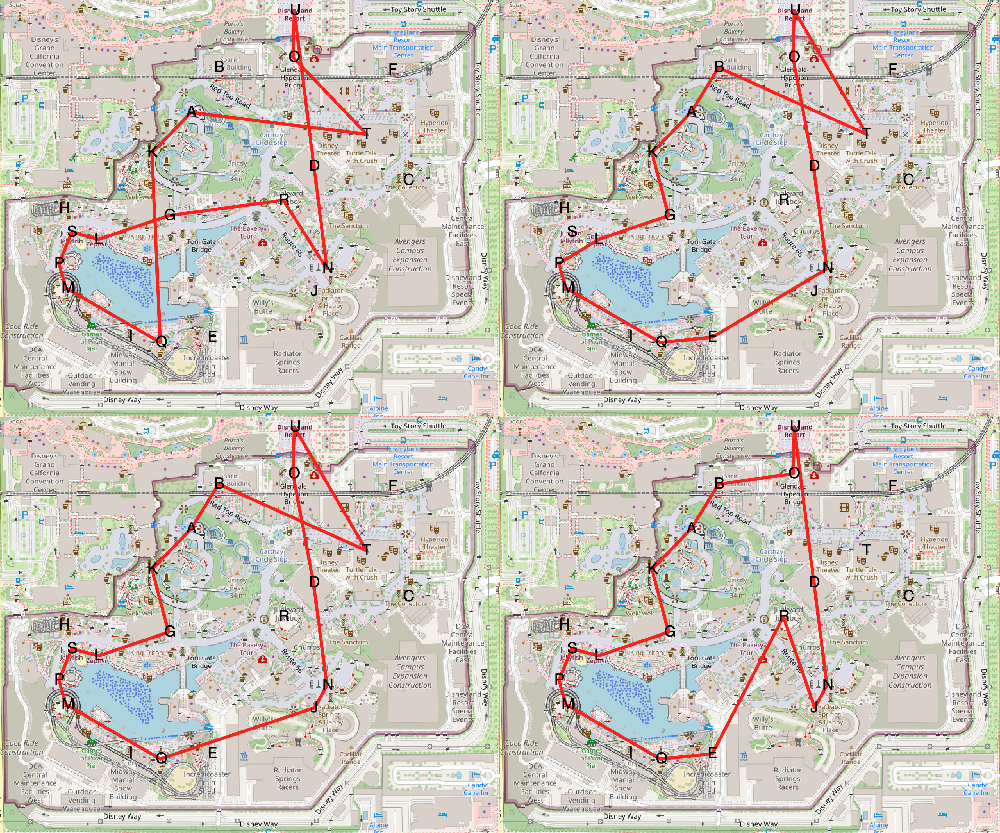

# DCA Tour 
Recently, my family and I travelled to Disney's California Adventure. Is there an optimal tour through the various rides, given levels of interest in rides reported by family members? 

This is framed as an optimization problem, where the objective is to find the maximum utility cycle through a subset of the total rides, subject to the constraint that the total time in the park remains less than some user defined maximum time. This can be framed as an integer linear program. 

The objective function and constraints are defined in the **Integer Linear Program** section, while the data is introduced in the **Datasets** section. Some tours are visualized in the **Results** section and the **Discussion & Potential Improvements section** contains some commentary. 

# Datasets 

|                                      |   utility |     wait |   ride_length |
|:-------------------------------------|----------:|---------:|--------------:|
| Soarin' Around the World             |      10.5 | 60.9937  |             5 |
| Radiator Springs Racers              |      11.5 | 78.1129  |             5 |
| Redwood Creek Challenge Trail        |       7.5 |  3.14604 |             5 |
| WEB SLINGERS: A Spider-Man Adventure |       7.5 | 36.3823  |             5 |
| Jessie's Critter Carousel            |       5   |  6.48488 |             5 |

**Table 1:** Example rows from ```/data/lp_data.csv```.  For each ride, I asked each subject/family member to provide a rating from 1-5, with larger ratings corresponding to greater interest. The sum of these ratings is the "utility" of a ride. Based on this [kaggle dataset](https://www.kaggle.com/datasets/tivory27/disney-california-adventure-wait-times?resource=download), some typical wait times for each ride were estimated. This is a major assumption, since wait times typically are not constant throughout the day. Finally, it is estimated that one spends 5 minutes on each ride. 


| from                           | to                                              |   time |
|:-------------------------------|:------------------------------------------------|-------:|
| Inside Out Emotional Whirlwind | Red Car Trolley                                 |      9 |
| Entrance                       | Goofy's Sky School                              |      8 |
| Radiator Springs Racers        | Grizzly River Run                               |      7 |
| Radiator Springs Racers        | The Little Mermaid - Ariel's Undersea Adventure |      5 |
| Toy Story Midway Mania!        | Monsters, Inc. Mike & Sulley to the Rescue!     |     10 |

**Table 2:** Example rows from ```/data/walk_times.csv```, showing time to walk from one ride to another, as estimated by Google maps. 

# Integer Linear Program
This is basically a union of the [0-1 knapsack problem](https://en.wikipedia.org/wiki/Knapsack_problem) and the [Miller–Tucker–Zemlin ILP formulation](https://en.wikipedia.org/wiki/Travelling_salesman_problem#Integer_linear_programming_formulations) of travelling salesperson. Consider the complete directed graph where vertices correspond to rides and directed edge $y_{ij}$ from ride $i$ to ride $j$ indicates riding ride $i$ and then ride $j$. The task is to select a subset of edges $y_{ij}$ that form a utility-maximizing cycle while not taking too much time. Edge inclusion is binary so $y_{ij} \in \lbrace0,1\rbrace$.

### Constraint 1: There must be an edge leaving the entrance
Suppose index $1$ corresponds to the entrance. The constraint is then: 

$$
\sum_{j} y_{1j} = 1
$$ 

### Constraint 2: There must be an edge entering the entrance
$$
\sum_{i} y_{i1} = 1
$$ 

### Constraint 3: For each ride, there must be an equal number of edges entering as exiting
$$
\sum_{k} y_{kj} = \sum_{l} y_{jl} \quad \forall j
$$ 

### Constraint 4: For each ride, at most one edge can be entering
$$
\sum_{k} y_{kj} \leq 1 \quad \forall j
$$ 

### Constraint 5: Cycle can't exceed maximum time
* Suppose maximum time is $M$. 
* There is a transit time $t_{ij}$ associated with every edge $y_{ij}$ indicating the time to walk from ride $i$ to ride $j$. 
* There is a ride time $r_{ij}$ associated with each edge $y_{ij}$, equal to $\frac{r_i + r_j}{2}$, where $r_i, r_j$ are how long it takes to ride rides $i,j$ respectively.  
* There is a wait time $w_{ij}$ associated with each edge $y_{ij}$, equal to $\frac{w_i + w_j}{2}$, where $w_i, w_j$ are how long one waits in line at rides $i,j$ respectively.  

For the last two bullet points, I am taking advantage of constraints 3 and 4 that ensure that every ride visited has exactly 0 or 2 edges incident.  The constraint is below. 

$$
\sum_{i,j} (t_{ij} + r_{ij} + w_{ij})y_{ij} \leq M
$$

### Constraint 6: MTZ Constraint 
The subtour elimination constraint is the same as the normal MTZ formulation of TSP. Again suppose the entrance corresponds to index $1$.  As with the normal MTZ approach to TSP, we want to introduce dummy variables $u_k$ that impose the constraints that $u_1 = 1$ and  $u_j \geq u_i + 1$ if $y_{ij} = 1$ **unless** $j=1$. Variable $u_j$ keeps track of the position of vertex $j$ in the cycle, relative to the entrance. 

Any cycle that doesn't include the entrance will not be able to satisfy this constraint. As an example, consider the hypothetical cycle through vertices $(3,5,8,9,3)$. Here $u_5 \geq u_3 + 1$, $u_8 \geq u_5 + 1$ ,etc. Therefore, $u_9 \geq u_3 + 3$. But there is an edge in the hypothetical cycle connecting vertices $9$ and $3$, which means that $u_3 \geq u_9 + 1$, which contradicts the previous constraint. So, cycles that don't include a specific vertex (here the entrance) are impossible. 

To encode the above ideas, a big-M formulation is used as below, where $n$ is the number of rides. 

$$
u_i - u_j + 1 \leq (n-1)(1-y_{ij})\quad 2 \leq i\neq j\leq n
$$

Is there a problem if vertex $k$ is not in the cycle? No, one can, for instance, set $u_k = 1$ for all $k$ not in the cycle. One can check that this results in the MTZ constraint being satisfied. 


# Results
Figure 1 shows some optimal tours for different maximum times in the theme park. 
<figure>
  
  <figcaption>Figure 1: The upper left, upper right, lower left, lower right panels show optimal tours for maximum disney times of 5,6,7,8 hours, respectively. </figcaption>
</figure>

The objective function specified does not yield a unique tour. For instance, traversing the cycle in one direction yields the same objective function evaluation as traversing the cycle in the other direction. Non unique tours can also arise in other ways. Consider hypothetical tours A and B, where B differs from A only in that a pair of low utility rides in A have been substituted for a single high utility ride in B. It can happen that tours A and B have the same the same objective function evaluation. 

Another notable feature of these tours is that they are sometimes self-intersecting, which never happens with Euclidean tsp tours. Between-ride walk times were estimated via Google Maps. As a consequence, transit times take into account the park walkways and are therefore sometimes non-euclidean. Considering the upper right and lower left tours in Figure 1, in the Euclidean case we could swap edges $OD, BT$ for edges $OB, TD$ and get a shorter tour. However, the shortest path from ride $D$ to ride $T$ involves walking around a large building, so $D$ and $T$ are further than they appear at first glance. Some statistics of the lower left tour are shown in the code segment below. 

```{python}
pprint.pprint(cycle_stats("UODNJQMPSLGKABTU", data, locations, 420)) #lower left: optimal

{'objective': 94.95833333333333,
 'ride_time': 70.0,
 'transit_time': 35,
 'utility': 95.0,
 'wait_time': 314.92420232238794}
```
Contrast the above statistics with some statistics about a non self-intersecting tour going through the same rides. Below we see that the self-intersecting tour yields one minute less transit time. The cycles summarized above and below are identical except for the swap of $OD, BT$ for $OB, TD$ (discussed above).
```{python}
pprint.pprint(cycle_stats("UOBAKGLSPMQJNDTU", data, locations, 420)) #lower left: not self intersecting

{'objective': 94.95714285714286,
 'ride_time': 70.0,
 'transit_time': 36,
 'utility': 95.0,
 'wait_time': 314.92420232238794}
```

| ride                                            | label   |
|------------------------------------------------|--------|
| Grizzly River Run                               | A       |
| Soarin' Around the World                        | B       |
| Guardians of the Galaxy - Mission: BREAKOUT!    | C       |
| WEB SLINGERS: A Spider-Man Adventure            | D       |
| Incredicoaster                                  | E       |
| Monsters, Inc. Mike & Sulley to the Rescue!     | F       |
| The Little Mermaid - Ariel's Undersea Adventure | G       |
| Goofy's Sky School                              | H       |
| Toy Story Midway Mania!                         | I       |
| Radiator Springs Racers                         | J       |
| Redwood Creek Challenge Trail                   | K       |
| Golden Zephyr                                   | L       |
| Inside Out Emotional Whirlwind                  | M       |
| Luigi's Rollickin' Roadsters                    | N       |
| Red Car Trolley                                 | O       |
| Silly Symphony Swings                           | P       |
| Jessie's Critter Carousel                       | Q       |
| Mater's Junkyard Jamboree                       | R       |
| Jumpin' Jellyfish                               | S       |
| Turtle Talk with Crush                          | T       |
| Entrance                                        | U       |
**Table 3**: Ride/Label Conversions


# Discussion & Potential Improvements
In practice, we almost immediately diverged from one of the proposed cycles. This occured for a few reasons, listed below.

* **Extremely Variable Wait Times:** Both Web Slingers and Radiator Springs Racers broke down repeatedly throughout the day, with lines oppressive at their peak but tantalizingly short for brief periods after reopening. The current approach assumes wait time to be unchanging throughout the day.  

* **Ride Closures:** A number of rides were closed for maintenance. 

* **Some Lines Are Nicer Than Others:** The weather during our day at DCA was beautiful but hot.  Waiting for 45 minutes in a shaded line proved far more attractive than 45 minutes in a line exposed to the sun.

* **Imperfectly Elicited Preference Data:** As an example, a number of the suggested tours include ride $T$, "Turtle Talk with Crush" despite the fact that no one particularly wanted to experience turtle talk. This is because the "utility" of a ride was defined as the sum of the various subjects' ratings on a 1-5 scale, meaning that with $n$ subjects the minimum utility was $n > 0$. This can partially be addressed by subtracting $n + \epsilon$ (where $\epsilon$ is some small positive constant) from each utility so that uninteresting rides have negative utility and will never be included in a tour. In addition, asking people to rate things on a 1-5 scale is perhaps not the best way to gauge interest. An experiment with pairwise comparisons could offer an alternative way of eliciting preference data. 


Addressing the above issues could make the model more useful. Maybe in time I will revisit this and address some of the above points. Regardless, I had a good time at DCA!  
